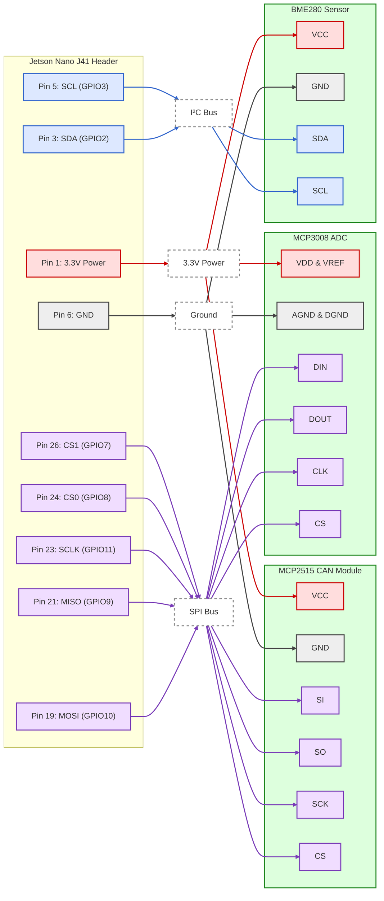
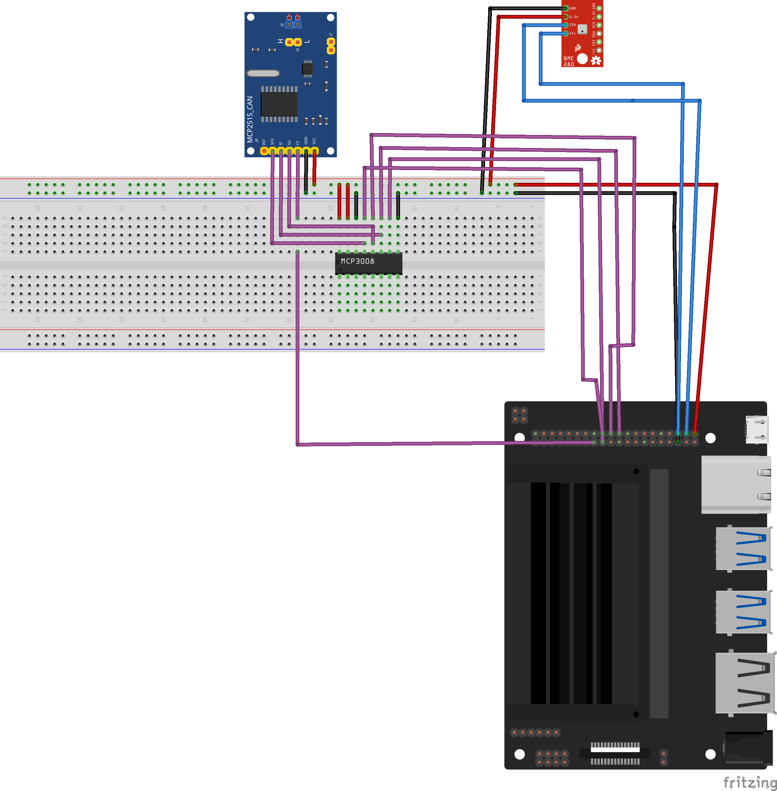
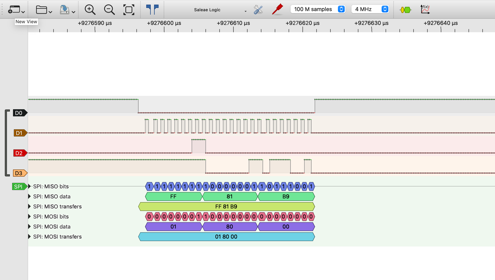

# Coach Jetson

## Overview
This project is an intelligent, edge-computing training assistant built on the Nvidia Jetson Nano. 

The system monitors boxing form and punch velocity via a camera feed, measures physical punch reaction timing via custom analog sensors, and tracks the environmental safety (temperature/humidity) of the training room to prevent overheating during intense sessions. 

Rather than relying on high-level Python abstraction libraries, the sensor drivers are written from scratch in C/C++ to directly interface with hardware registers via I2C and SPI protocols. Hardware timings and protocol structures are verified using a 24 MHz sample rate USB logic analyzer capturing a 1 MHz SPI bus.

## Hardware Architecture
* **Compute Node:** Nvidia Jetson Nano (Master Device)
* **Vision/AI:** Raspberry Pi Camera V2 (MIPI-CSI)
* **Environment Sensor:** Bosch BME280 (I2C) - Temperature, Humidity, Pressure
* **Touch/Timing ADC:** Microchip MCP3008 8-Channel 10-bit ADC (SPI)
* **Network/Comms:** HiLetgo MCP2515 CAN Bus Module (Integrated MCP2515 Controller & TJA1050 Transceiver)
  * *Note on CAN:* This module integrates an 8 MHz crystal oscillator which dictates the baud rate math for the `CNF1`, `CNF2`, and `CNF3` registers. While the onboard TJA1050 transceiver is nominally a 5V component, the module is powered via the Jetson's 3.3V rail. This ensures the SPI logic lines (MISO) do not output 5V and damage the Jetson Nano. Operating the TJA1050 at 3.3V is sufficient for internal loopback testing and short benchtop runs.
* **Hardware Debugging:** 8-Channel USB Logic Analyzer (Sigrok PulseView)


## Wiring Architecture
```text
🔴 Power (3.3 V) || ⚫ Ground || 🔵 I²C || 🟣 SPI || 🟢 Devices
```


 
The Jetson Nano's 40-pin J41 header is utilized for all hardware communication.

**Note**: _All logic operates strictly at 3.3V. The power rails have been standardized to J41 Pin 1 (3.3V) and Pin 6 (GND) to ensure a shared common ground across the SPI and I2C buses._

| Component | Pin Function | Jetson Nano Pin | Protocol |
| :--- | :--- | :--- | :--- |
| **BME280** | VCC | Pin 1 (3.3V) | Power |
| | GND | Pin 6 (GND) | Power |
| | SDA | Pin 3 (SDA) | I2C Bus 1 |
| | SCL | Pin 5 (SCL) | I2C Bus 1 |
| **MCP3008**| VDD / VREF | Pin 1 (3.3V) | Power |
| | AGND / DGND | Pin 6 (GND) | Power |
| | CLK | Pin 23 (SCLK) | SPI Bus 0 |
| | Dout (MISO) | Pin 21 (MISO) | SPI Bus 0 |
| | Din (MOSI) | Pin 19 (MOSI) | SPI Bus 0 |
| | CS / SHDN | Pin 24 (CE0) | SPI Bus 0 |
| **MCP2515**| VCC | Pin 1 (3.3V) | Power |
| | GND | Pin 6 (GND) | Power |
| | SCK | Pin 23 (SCLK) | SPI Bus 0 |
| | SO (MISO) | Pin 21 (MISO) | SPI Bus 0 |
| | SI (MOSI) | Pin 19 (MOSI) | SPI Bus 0 |
| | CS | Pin 26 (CE1) | SPI Bus 0 |


*(Note: The Logic Analyzer grabber clips are attached directly to the MCP3008 SPI pins on the breadboard to monitor SCLK, MISO, MOSI, and CS).*


## System Bring-up & Device Trees
By default, the Jetson Nano may not expose the hardware buses to user space. To interface with the hardware, the system is configured via jetson-io.py to enable the 40-pin expansion header features.

The application expects the following device nodes to be available and accessible by the user  
(typically requiring `usermod -aG i2c,dialout $USER`):
* `/dev/i2c-1` (BME280)
* `/dev/spidev0.0` (MCP3008)
* `/dev/spidev0.1` (MCP2515)

## Hardware Edge Cases & Failure Modes
Robust embedded software must anticipate physical failures. This project is designed to handle or gracefully acknowledge the following fault states:

* **I2C NACK**: If the BME280 is disconnected or loses power, the I2C read operation will return a NACK (Not Acknowledge). The driver checks the ioctl return values rather than blindly processing garbage bytes as a temperature reading.

* **SPI Desynchronization**: If electrical noise causes a missed clock edge on the SPI bus, the MCP3008 10-bit response will be misaligned. Software filters bounds-check the ADC output to drop anomalous spikes (e.g., reading a physical impossibility like 0xFFF).

* **CAN TX Buffer Saturation**: If the physical CAN bus goes down, the MCP2515 transmit buffers will fill up. The C application polls the TXB0CTRL register to ensure the buffer is clear before attempting to push new telemetry data, preventing silent blocking.


## Development Roadmap
- [x] ~~**Phase 1: Foundation.** Hardware acquisition, wiring architecture, and repository setup.~~
    
- [x] ~~**Phase 2: Environment Monitor.** Bare-metal C driver for the BME280 (I2C) to read raw calibration registers and compute environmental data.~~
    
- [x] ~~**Phase 3: Cognitive Reflex Target (Capacitive Touch, DSP Signal Processing & Timing).** C/C++ SPI driver for the MCP3008. (_Replaced standard physical force sensors with a software-based Digital Signal Processing (DSP) algorithm_)\
The code captures rapid bursts of ADC readings to measure the peak-to-peak amplitude of 60Hz ambient electromagnetic noise amplified by human touch. Integrated high-resolution Linux timers (`<sys/time.h>`) to measure boxer reaction speed in milliseconds following a randomized software cue.~~

- [x] ~~**Phase 4: CAN Bus Foundation.** Initialized the MCP2515 CAN controller via SPI. Established an internal loopback network to verify register configurations. *Optimization: Transitioned from CPU-heavy polling to a non-blocking hardware interrupt architecture using the Jetson's GPIO and the Linux `poll()` system call.*~~    
    
- [ ] **Phase 5: The AI Coach.** Implementing OpenCV/Pose Estimation to track shadow-boxing form and punch extension via the Pi Camera.
    
- [ ] **Phase 6: Distributed Edge Node.** Expanding the architecture to a physical multi-node network. Migrating the reflex sensor to a Raspberry Pi Zero 2 W edge device, communicating real-time punch telemetry back to the Jetson Master via a physical CAN Bus (CAN-H/CAN-L) differential pair.
    
- [ ] **Phase 7: Final Integration.** Fusing the distributed C-based sensor data (environment and remote reflex timing) with the AI vision application into a single, cohesive edge-computing training dashboard.

## Signal Analysis & Hardware Verification

### Phase 3: SPI & DSP Capacitive Touch Timing
To verify the custom SPI driver and DSP timing, the SPI bus was monitored using a 24MHz USB Logic Analyzer during a reflex drill.



**Capture Breakdown:**
* **Sample Rate:** 4 MHz capturing a 1 MHz SPI clock.
* **MOSI (Jetson TX):** `0x01 0x80 0x00` - The C driver successfully creates the Start Bit, Single-Ended mode bit, and targets Channel 0.
* **MISO (Sensor RX):** `0xFF 0x81 0xB9` - The MCP3008 responds with a 10-bit ADC reading of 441, showing the DSP algorithm successfully catching the mid-point of the 60Hz electromagnetic wave amplified by the boxer's touch.
